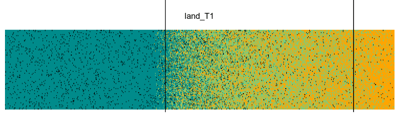
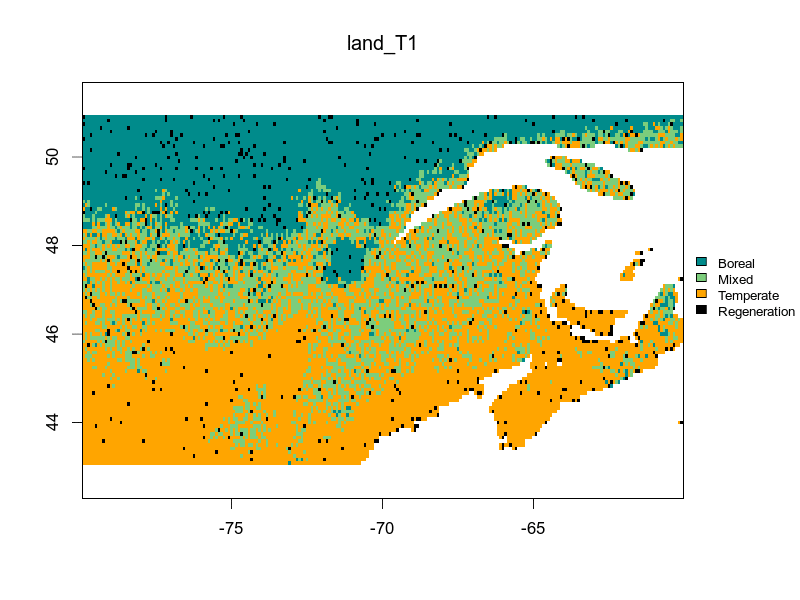

---
output:
  xaringan::moon_reader:
  #  self_contained: TRUE
    includes:
      in_header: conf/style-header.html
    lib_dir: assets
    seal: false
    css: ["default", "conf/css/style.css", "conf/css/fonts.css"]
    nature:
      beforeInit: "conf/style-macros.js"
      slideNumberFormat: | # to add a progress bar
        <div class="progress-bar-container">
          <div class="progress-bar" style="width: calc(%current% / %total% * 100%);">
          </div>
        </div>
---

```{r setup, echo = F}
knitr::opts_chunk$set(
  comment = "#",
  #cache = TRUE,
  collapse = TRUE,
  warning = FALSE,
  message = FALSE,
  fig.width = 7,
  fig.height = 5.25,
  fig.align = 'center'
)

mypar = list(mar = c(3,3,0.5,0.5), mgp = c(1.5, 0.3, 0), tck = -.008)
library(STManaged)
```
class: middle, title-slide

# LAB: {STManaged} R package

### Willian Vieira

<br><br><br><br><br>
<i class="fa fa-github fa-2x" style="color:#335049"></i> [WillVieira/talk_biodiversityModeling2019](https://github.com/willvieira/talk_biodiversityModeling2019)

<i class="fa fa-home fa-2x" style="color:#335049"></i> [https://willvieira.github.io/STManaged/](https://willvieira.github.io/STManaged/)

---
class: inverse, center, middle

# LAB

## {STManaged} R package

---

## LAB steps

1. Install package
2. Functions of the package
3. Understanding the package output

---
## STManaged R package: install

<i class="fa fa-github fa-2x" style="color:#335049"></i> [WillVieira/talk_biodiversityModeling2019](https://github.com/willvieira/talk_biodiversityModeling2019)

```r
devtools::install_github("willvieira/STManaged")
```

For Linux users, install `ImageMagick++` library before


---
## STManaged R package: main functions

- Create the initial landscape
```r
create_virtual_landscape()
```

- run the model
```r
run_model()
```

---
## STManaged R package: initial landscape

```{r}
initLand <- create_virtual_landscape(climRange = c(-2.61, 5.07),
                                     cellSize = 1)
```

plot `initLand`:

```{r,fig.width=12,fig.height=3}
plot_landscape(initLand, xaxis = TRUE)
```

---
## STManaged R package: run the model

```r
lands <- run_model(steps = 20,
                   initLand,
                   managInt = c(0, 0, 0, 0),
                   RCP = 8.5)
```

```{r, echo=FALSE}
load('data/lands.Rdata')
```

<!-- save(lands, file = 'GitHub/talk_biodiversityModeling2019/data/lands.Rdata')-->

--

```{r}
names(lands)
```

---
## STManaged R package: output

- landscape occupancy

```{r,fig.width=12}
par(mfrow = c(1, 2))
plot_occupancy(lands, step = 0, spar = 0.4)
plot_occupancy(lands, step = 20, spar = 0.4)
```

---
## STManaged R package: output

- animate temporal dynamic

```r
animate(lands, fps = 2)
```

--



---
class: inverse, center, middle

# Using real landscape

---
## STManaged R package: initial landscape

```{r}
initLand <- create_real_landscape()
```

plot `initLand`:

```{r,fig.width=10.5}
plot_landscape(initLand)
```

---
## STManaged R package: run the model

```r
lands <- run_model(steps = 20,
                   initLand,
                   managInt = c(0, 0, 0, 0))
```

Note: the only `RCP` scenario is `8.5`

```{r, echo=FALSE}
load('data/landsReal.Rdata')
```

--

```{r}
names(lands)
class(lands[['lands']])
names(lands[['lands']])
```

---
## STManaged R package: output

- animate temporal dynamic

```r
animate(lands, fps = 2)
```

--
.center[
  
]
